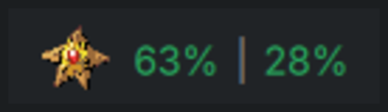

# PokeTokenBar for Linux / KDE Plasma

An unofficial Linux port of [**PokeTokenBar**](https://github.com/chattymin/PokeTokenBar)
by [**chattymin**](https://github.com/chattymin) — the macOS menu bar app that turns the
AI coding tokens you're already burning into a growing Pokémon companion.

This directory adds a Python daemon and two KDE Plasma 6 widgets that reproduce
that experience on Linux. **Everything in the original macOS app is untouched** —
no file under `Sources/`, `Tests/`, `Package.swift`, or `scripts/` was modified.

<div align="center">

<br><em>Your companion beside the 5-hour and weekly limits, coloured by how close you are.</em>
</div>

---

## Credits

**All original design, game balance, and the idea belong to
[chattymin](https://github.com/chattymin)** and the contributors to the upstream
[PokeTokenBar](https://github.com/chattymin/PokeTokenBar) project. This is a port,
not a reimagining: the token economy, evolution pacing, rarity curve, hatch
thresholds, shiny odds, and shop prices are all copied verbatim from the Swift
source because they are tuned values, and changing them would change the game.

- Upstream project: <https://github.com/chattymin/PokeTokenBar> (MIT)
- Pokémon data and sprites: [PokéAPI](https://pokeapi.co/) and
  [PokeAPI/sprites](https://github.com/PokeAPI/sprites), fetched at runtime and
  cached locally — nothing is bundled in this repository
- Pokémon is a trademark of Nintendo / Creatures Inc. / GAME FREAK Inc.
  This is an unofficial, non-commercial fan project with no affiliation

If you like this, **star the upstream repo, not this fork.** The good idea is theirs.

## How this was built

**This port was vibe-coded.** Essentially all of the Python and QML here was
written by Claude (Anthropic's Claude Code) across a single long session, working
from the Swift source as the specification, with me steering, testing on my own
machine, and sending screenshots of the macOS app when the port drifted from it.

Being blunt about what that means:

- **It is verified where verification was possible, and not where it wasn't.**
  The Claude Code parser was checked against my real 559 MB of logs. The Codex
  parser was checked against the upstream Swift test fixtures and matches their
  expected totals exactly (312,814 and 369,215). The companion engine, save
  decoding, and economy have 265 tests.
- **Several bugs were only caught because I looked at the screen.** The panel
  silently failed for an entire iteration because Qt blocks `XMLHttpRequest` on
  `file://` URLs; the Pokédex hid the active companion because I built it from
  graduated entries only; the settings dialog opened empty because Plasma
  requires a `cfg_<key>Default` property I hadn't declared. Tests did not catch
  any of those.
- **Read the code before trusting it with anything that matters.** It only reads
  local log files and one Anthropic endpoint, but you should confirm that
  yourself rather than take my word for it.

## What works

| | |
|---|---|
| **Panel widget** | 5-hour and weekly limit percentages, colour-coded green/yellow/red, with your animated companion |
| **Popup** | Home, Shop, Bag, Collection tabs |
| **Usage tracking** | Claude Code and Codex, read from local logs — today, this week, this month, with cost |
| **Official limits** | 5-hour and weekly utilization, reset countdowns, and a burn-rate forecast |
| **Companion** | egg → hatch → evolve → graduate, 25 natures, shiny (1/64), Ditto disguise |
| **Economy** | Rare Candy, Mint, Shiny Charm, three egg grades; candy awarded when a limit window fills |
| **Collection** | species-level Pokédex with rarity filters and paging, plus a per-catch log |
| **Floating pet** | a second desktop widget — drag, hover, right-click, speech bubbles |
| **Notifications** | hatch, evolution, graduation, and limit warnings via `notify-send` |
| **Languages** | English, 한국어, 日本語, Español |

## What is missing

Compared to the macOS app:

- **Eight of the ten usage providers.** Only Claude Code and Codex are ported.
  Gemini, Grok, Hermes, Copilot, Cursor, OpenCode, Kiro, and Antigravity are not —
  I have no data for any of them, so porting them would mean shipping code
  nobody could verify. The provider interface is unchanged, so each is a single
  file when someone who uses one wants to add it.
- In-app updater, crash reporter, support mail, and Keychain handling — macOS
  concepts with no Linux equivalent, or unnecessary here (Claude Code stores
  credentials in plaintext on Linux).
- A diagnostics/log viewer.

## Requirements

- KDE Plasma 6 (developed on 6.7.4, Qt 6.11)
- Python 3.12+
- `notify-send` for notifications (optional)
- `orjson` is used if present and falls back to the standard library if not

## Install

### Arch / CachyOS / EndeavourOS (recommended)

```bash
git clone https://github.com/rubensanchezrivero/PokeTokenBar.git
cd PokeTokenBar/linux/packaging
makepkg -si
systemctl --user enable --now poketokend
```

Installs system-wide, with no venv and no copies under `$HOME`. Uninstall with
`sudo pacman -R poketokenbar-plasma`.

### Any other distro

```bash
git clone https://github.com/rubensanchezrivero/PokeTokenBar.git
cd PokeTokenBar
./linux/install.sh
```

Self-contained: creates its own venv and installs everything under `$HOME`,
touching nothing system-wide.

### Widgets only

If you'd rather run the daemon yourself, build installable bundles:

```bash
./linux/packaging/build-plasmoids.sh
kpackagetool6 -t Plasma/Applet -i linux/dist/org.kde.plasma.poketokenbar.plasmoid
kpackagetool6 -t Plasma/Applet -i linux/dist/org.kde.plasma.poketokenpet.plasmoid
```

The widgets only render whatever the daemon writes to `state.json`, so the
daemon still has to be running.

---

With `install.sh`, everything lands under `$HOME`:

| Path | Contents |
|---|---|
| `~/.local/share/poketokenbar/` | the Python package and its venv |
| `~/.local/bin/poketokenctl` | control CLI |
| `~/.local/share/plasma/plasmoids/` | the two widgets |
| `~/.config/systemd/user/poketokend.service` | the daemon, enabled and started |
| `~/.local/state/poketokenbar/state.json` | what the widgets render |
| `~/.config/poketokenbar/config.json` | settings |
| `~/.cache/poketokenbar/` | scan cache, sprites, PokéAPI data |

Then right-click your panel → **Add Widgets** → **PokeTokenBar**.
For the desktop pet, add **PokeTokenBar Pet** to your desktop.

## Usage

Settings live in the widget's configuration dialog (gear icon in the popup, or
right-click → Configure). Everything is also reachable from the CLI:

```bash
poketokenctl set show_tokens_in_menu true
poketokenctl set language ja
poketokenctl refresh
poketokenctl export ~/poketokenbar-save.json
poketokenctl import ~/poketokenbar-save.json
```

## A note if you use several Claude accounts

Session logs under `~/.claude/projects/` carry **no account marker**, so token
totals from every account you use on the machine are summed and cannot be
separated. Limits, by contrast, come from `~/.claude/.credentials.json`, which
only ever holds the account currently logged in.

The popup therefore names the account the limits belong to. If you want accounts
kept fully apart, give each one its own `CLAUDE_CONFIG_DIR` — the parser honours
it — though that currently needs one daemon per account.

## Architecture

A daemon owns all state; the widgets only render.

```
~/.claude/projects/**/*.jsonl ──▶ poketokend (Python, systemd --user)
                                      │  parses, prices, grows the companion
                                      ▼
                         ~/.local/state/poketokenbar/state.json
                                      │  polled every 2s
                                      ▼
                    Plasma widgets (QML)  ──▶ poketokenctl ──▶ daemon
```

The companion has to keep growing while the popup is shut, and Plasma reloads
applets whenever you edit the panel — so game state lives in the daemon, never in
QML. Widgets talk back only through `poketokenctl`, which keeps validation in one
place.

## Development

```bash
cd linux
python3 -m venv .venv && ./.venv/bin/pip install pytest
./.venv/bin/pytest -q
```

The Swift sources are the specification. Port behaviour from them rather than
re-deriving it, and read `docs/reference/defect-log.md` before touching a
subsystem — it records bug classes the macOS app already paid for.

## Troubleshooting

```bash
systemctl --user status poketokend
journalctl --user -u poketokend -n 50 --no-pager
```

If the panel shows nothing, the daemon isn't writing `state.json` — read the
journal before changing anything. After editing QML, Plasma caches compiled
bytecode; `rm -rf ~/.cache/plasmashell && systemctl --user restart
plasma-plasmashell` forces a reload.

The first scan parses every log file (~9 s on 559 MB here); later scans are
~0.1 s from the incremental cache.

## Licence

MIT, same as upstream. See [`LICENSE`](../LICENSE).
